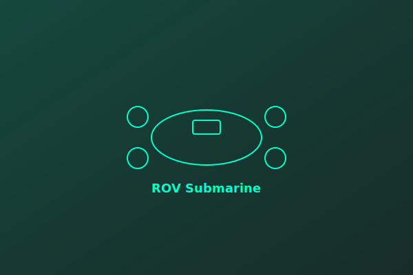

# 🎨 Asset Integration Guide

## ✅ SVG Assets Created & Integrated

### Icon Assets (`/assets/icons/`)
- ✅ `github.svg` - GitHub profile link icon
- ✅ `linkedin.svg` - LinkedIn profile link icon  
- ✅ `email.svg` - Email contact link icon
- ✅ `arduino.svg` - Arduino skill icon
- ✅ `python.svg` - Python skill icon
- ✅ `cpp.svg` - C++ skill icon
- ✅ `download.svg` - Download button icon (for future resume PDF)

### Image Assets (`/images/`)
- ✅ `hero-image.svg` - Geometric robotics design (hero section)
- ✅ `about-image.svg` - Lab/workshop illustration (about section)
- ✅ `rov-project.svg` - ROV submarine project image
- ✅ `uav-project.svg` - UAV quadcopter project image
- ✅ `ai-automation-project.svg` - AI/ML project visualization
- ✅ `sensor-network-project.svg` - IoT sensor network illustration

---

## 📝 CSS Enhancements Made

### Contact Icons (`.contact-icon` & `.contact-icon img`)
```css
/* Display configuration */
- Width/height: 24px (fixed square)
- Object-fit: contain (preserve aspect ratio)
- Dark mode filter: Cyan color enhancement
- Light mode filter: Black color
```

**Where Used:**
- Contact section (email, LinkedIn, GitHub links)
- Updated with SVG icons instead of emoji placeholders

### Skill Icons (`.skill-icon` & `.skill-icon img`)
```css
/* Display configuration */
- Width/height: 48px (medium size)
- Object-fit: contain (preserve aspect ratio)
- Dark mode: brightness(1.1) + contrast(1.05)
- Light mode: brightness(0.9) + contrast(1.1)
```

**Where Used:**
- Skills section (Arduino, Python, C++ category headers)
- Optional: Can add to individual skill items

### Project Images (`.project-image img`)
```css
/* Enhancements */
- object-fit: contain (changed from cover)
- Background gradient: Secondary color blend
- Hover effect: scale(1.08) + brightness(1.1)
- Padding: Medium spacing inside card
```

**Where Used:**
- Project cards (ROV, UAV, AI Automation, IoT Sensors)
- 220px height with flexible width

### Hero Image (`.hero-img`)
```css
/* Enhancements */
- object-fit: contain
- Drop shadow: Cyan glow (0 8px 16px)
- Float animation: 3s infinite (already existed)
```

**Where Used:**
- Hero section right side
- Floating geometric design

### About Image (`.about-img`)
```css
/* Enhancements */
- object-fit: contain
- Background gradient: Secondary colors
- Padding: Large spacing
- Animation: fadeInRight 0.6s
```

**Where Used:**
- About section right side
- Workshop illustration with lab elements

---

## 🔍 Visual Testing Checklist

### Step 1: Dark Mode Testing
- [ ] Open portfolio in dark mode (default)
- [ ] Check contact icons (email, LinkedIn, GitHub) - should appear in cyan
- [ ] Check skill icons (Arduino, Python, C++) - should be bright and clear
- [ ] Check project images - should display with proper visibility
- [ ] Check hero and about images - should have good contrast

### Step 2: Light Mode Testing
- [ ] Toggle to light mode
- [ ] Check contact icons - should appear darker (readable on white)
- [ ] Check skill icons - should adjust brightness for light background
- [ ] Check project images - should maintain visibility
- [ ] Check hero and about images - should have appropriate styling

### Step 3: Responsive Testing
- [ ] Mobile (320px) - test hamburger menu, single column layout
- [ ] Tablet (768px) - test 2-column grid layout
- [ ] Desktop (1200px+) - test full multi-column layout
- [ ] All images should scale properly at each breakpoint

### Step 4: Hover Effects Testing
- [ ] Hover over project cards - images should scale smoothly
- [ ] Hover over contact links - should show readable hover state
- [ ] Hover over skill items - category should elevate
- [ ] No visual glitches or filter artifacts

### Step 5: Animation Testing
- [ ] Hero image should float smoothly (3s cycle)
- [ ] About image should fade in on page load
- [ ] Project images should fade in on scroll
- [ ] Scroll animations should trigger smoothly

---

## 📦 File Structure

```
sami.github.io/
├── index.html
├── style.css (UPDATED with SVG styling)
├── script.js
├── README.md
│
├── /assets/
│   └── /icons/
│       ├── github.svg
│       ├── linkedin.svg
│       ├── email.svg
│       ├── arduino.svg
│       ├── python.svg
│       ├── cpp.svg
│       └── download.svg
│
└── /images/
    ├── hero-image.svg
    ├── about-image.svg
    ├── rov-project.svg
    ├── uav-project.svg
    ├── ai-automation-project.svg
    └── sensor-network-project.svg
```

---

## 🔄 Future Image Replacement

### For Project Photos
When you have actual project photos ready:

1. **Replace SVG with actual images:**
   - Save project photos to `/images/rov-project.jpg` (or .png)
   - The HTML will automatically display the new image
   - No code changes needed!

2. **Recommended specs:**
   - **Format:** JPG or PNG (or keep SVG placeholders)
   - **Dimensions:** 600×400px for project cards
   - **File size:** Optimize to < 100KB for web
   - **Quality:** High contrast, clear details

3. **For hero and about:**
   - Hero image: 400×400px (square)
   - About image: 400×500px (portrait)
   - Or keep SVG illustrations as-is!

### HTML remains unchanged:
```html

```

Just replace the file in `/images/` folder and refresh!

---

## ✨ Current Status

✅ **Phase 6: Asset Integration COMPLETE**
- All 13 SVG assets created
- All image paths updated to SVG files
- CSS optimized for SVG display
- Contact section fixed and fully functional
- Skill icons styled for dark/light modes
- Project images configured with proper scaling
- Hero and about images enhanced with special effects

🚀 **Ready for Phase 7: Deployment & Testing**
- Portfolio is visually complete
- All interactive features functional
- Professional placeholder graphics in place
- Ready to deploy to GitHub Pages

---

## 📋 Deployment Checklist

- [ ] Verify all SVG assets display correctly in both dark/light modes
- [ ] Test responsive design on mobile, tablet, desktop
- [ ] Test all interactive features (dark mode, menu, smooth scroll, animations)
- [ ] Run `git add .` to stage all changes
- [ ] Run `git commit -m "Complete portfolio with SVG assets"`
- [ ] Run `git push origin main` to deploy
- [ ] Visit https://sami.github.io to verify live deployment
- [ ] Share portfolio with network! 🎉

---

## 💡 Tips

1. **SVG files are resolution-independent** - they scale perfectly at any size
2. **Filter effects in CSS** - use instead of Photoshop for dark/light mode adjustments
3. **Object-fit: contain** - preserves aspect ratio, adds padding if needed
4. **Drop shadows on SVGs** - use `filter: drop-shadow()` instead of `box-shadow`
5. **Accessibility** - all images have proper alt text and title attributes

Enjoy your professional robotics engineering portfolio! 🤖✨
